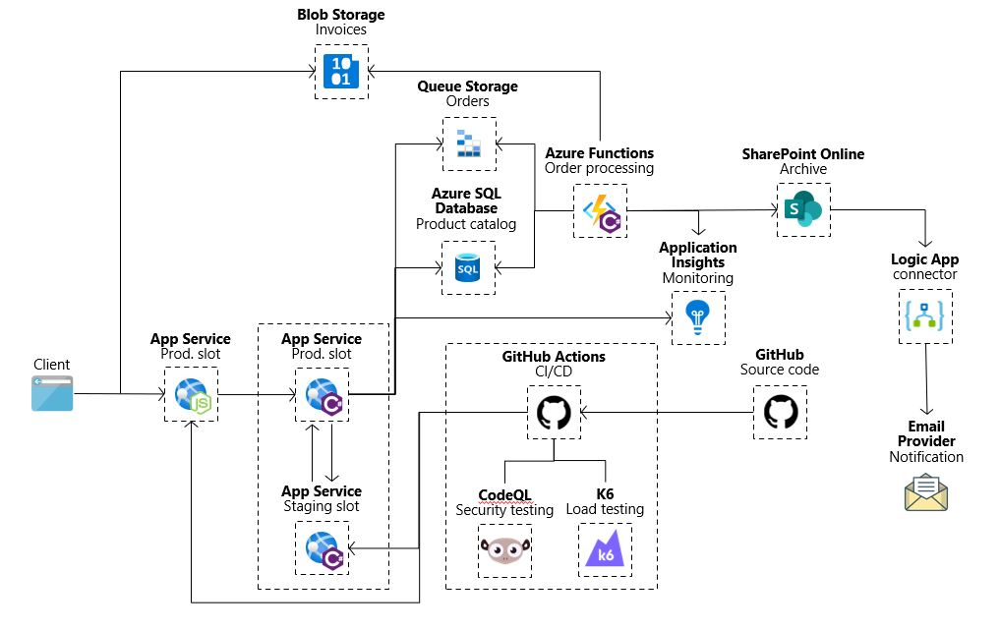

  

## Solution architecture
Below is a high-level architecture diagram of the solution you implement in this hands-on lab. Please review this carefully to understand the whole of the solution as you are working on the various components.

